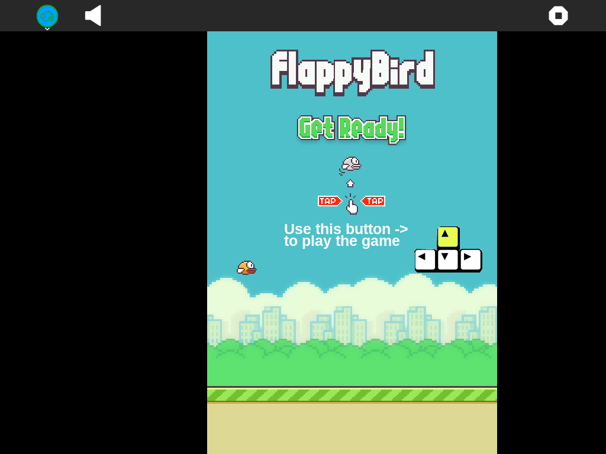

What is this?
=============

Flappy Birds is an arcade game for the Sugar desktop.



How to use?
===========

Flappy Birds is not part of the Sugar desktop, but can be added.  Please refer to;

* [How to Get Sugar on sugarlabs.org](https://sugarlabs.org/),
* [How to use Sugar](https://help.sugarlabs.org/),
* [Download Flappy Birds using Browse](https://activities.sugarlabs.org/), search for `Flappy Birds`, then download, and;
* Refer the 'How to play' section inside the activity

How to upgrade?
===============

On Sugar desktop systems;
* use [My Settings](https://help.sugarlabs.org/my_settings.html), [Software Update](https://help.sugarlabs.org/my_settings.html#software-update), or;
* use Browse to open [activities.sugarlabs.org](https://activities.sugarlabs.org/), search for `Flappy Birds`, then download.

How to run?
=================

Flappy Birds depends on Python, PyGTK and PyGame.

Flappy Birds is started by [Sugar](https://github.com/sugarlabs/sugar).

Flappy Birds is not packaged by Debian, Ubuntu and Fedora distributions.  
On Ubuntu and Debian systems these required dependencies (`python-gtk2-dev` and
`python-pygame`) need to be manually installed.
On Fedora system these dependencies (`pygtk2` and `pygame`) need to be manually installed.


**Running outside Sugar**


- Install the dependencies - 

On Debian and Ubuntu systems;

```
sudo apt install python-gtk2-dev python-pygame
```

On Fedora systems;

```
sudo dnf install pygtk2 pygame
```

- Clone the repo and run-
```
git clone https://github.com/sugarlabs/flappy-birds-activity.git
cd flappy-birds-activity
python main.py
```

**Running inside Sugar**

- Open Terminal activity and change to the Flappy Birds activity directory
```
cd activities\FlappyBirds.activity
```
- To run
```
sugar-activity .
```
